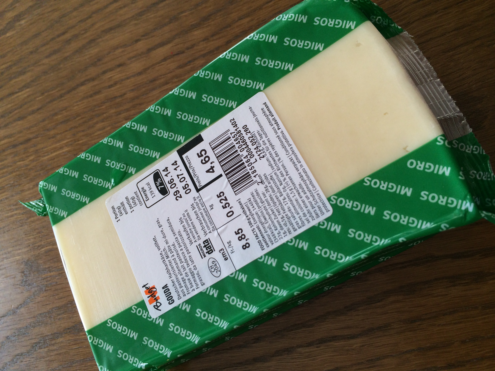

# From Gouda callbacks to Appenzeller CSP

## A quick survey of asynchronous programming models

 

---

# [fit] Grüezi!


---


---

 

---

# Ivan, aka @ikr

* MSc in Mathematics from NSU, Russia
* Living off programming since 2000-03-13
  * C++/Win32/GDI+/MFC/WTL
  * Visual Basic 😱
  * Java Servlets & Swing, C#
  * PHP, *__JavaScript__*


---

# The kind of JavaScript I like

```javascript
var Y = function (f) {
        return function (self) {
            return function (x) {
                return f(self(self))(x);
            };
        }(
            function (self) {
                return function (x) {
                    return f(self(self))(x);
                };
            }
        );
    };
```

---

# The kind of JavaScript I like

```lisp
(define Y 
    (lambda (f)
        ((lambda (x) (x x))
        (lambda (x) (f (lambda (y) ((x x) y)))))))
```

---

# [fit] Why async matters?

---

## Software's eating the world, __and__

## (our) _Free lunch is over_ ―Herb Sutter, 2005

---

# Now, we can only go faster by doing __many things at once__

---

# Threads!


---

# Place-oriented programming!


 ---

# Shared memory!


---

*There are __just a few__ people in the world who can reason effectively about __deadlocks & race conditions__ … They all must be __enslaved__, and made to work on operating systems. And nobody else should go near of this stuff, because it's just __way too complicated.__*

_―Douglas Crockford_


^Photo by Robert Claypool, [CC-licensed](https://creativecommons.org/licenses/by/2.0/), available [here](https://www.flickr.com/photos/35106989@N08/8455616670/)

---

# Alternatives

1. Actors / Message passing
2. Streams / Reactive programming
3. Implicit parallelism: DSL-s, logic programming
4. Event loop

^Speak about declarative

---

# Alternatives

1. Actors / Message passing
2. Streams / Reactive programming
3. Implicit parallelism: DSL-s, logic programming
4. __Event loop__

^Why event loop happened in JS? GUI!

---

# Event loop

```javascript
var event;

while (true) {
    event = System.runtime.nextEvent();
    handle(event);
}
```

---

# Event loop

* Single thread of execution
* No multiprogramming with shared state
* No locking
* No race conditions

---

# Event loop

* Single thread of execution
* No multiprogramming with shared state
* No locking
* No race conditions
* ...And Justice for All 

^Perfect? Almost

---

# The price

1. You must never block

---

# The price

1. You must never block
2. You must never _ever_ block

```javascript
while (true) {
    event = System.runtime.nextEvent();
    handle(event);
}
```

---

# The price

1. You must never block
2. You must never _ever_ block
3. Recovering from an exception is practically impossible (JavaScript-specific)

^ More on that later

---

# The price

1. You must never block
2. You must never _ever_ block
3. Recovering from an exception is practically impossible (JavaScript-specific)
4. __Callbacks__

---

# Why do callbacks even emerge?

---

# Never wait


---

# Never wait

```javascript
var result = doTheWork(a, b);
```

---

# Never wait

```javascript
doTheWork(a, b, function (result) {
    console.log('Got %s', result);
});
```

---

# Example: objects search


---

```javascript
strictMatches(query, function (ids) {
    if (!ids[0]) {
        // Try fuzzy matching
    }

    // In either case, fetch the matched objects' details 
});
```

---

```javascript
strictMatches(query, function (ids) {
    if (!ids[0]) {
        fuzzyMatches(query, function (ids) {
            fetchDetails(ids, function (details) {
                console.dir(details);
            })
        });
    }
    else {
        fetchDetails(ids, function (details) {
            console.dir(details);
        })
    }
});
```

---

```javascript
strictMatches(query, function (ids) {
    if (!ids[0]) {
        fuzzyMatches(query, function (ids) {
            // Now we need details and photos
        });
    }
    else {
        // Same here
    }
});
```

---

```javascript
strictMatches(query, function (ids) {
    if (!ids[0]) {
        fuzzyMatches(query, function (ids) {
            fetchDetails(ids, function (details) {
                fetchPhotos(ids, function (photos) {
                    console.dir(_.merge(details, photos));
                })
            })
        });
    }
    else {
        fetchDetails(ids, function (details) {
            fetchPhotos(ids, function (photos) {
                console.dir(_.merge(details, photos));
            })
        })
    }
});
```

---

# Fetch details and photos in parallel

```javascript
var universalHandler = function () {
        var details, photos;

        return {
            detailsArrived: function (xs) {
                details = xs;
            },

            photosArrived: function (xs) {
                photos = xs;
            }
        };
    };
```

---

# Fetch details and photos in parallel

```javascript
var universalHandler = function (callback) {
        var details,
            photos,

            check = function () {
                if (details && photos) callback(details, photos);
            },

            return {
                detailsArrived: function (xs) { details = xs; },
                photosArrived: function (xs) { photos = xs; }
            };
    };
```

---

# Fetch details and photos in parallel

```javascript
var universalHandler = function (callback) {
        var details,
            photos,

            check = function () {
                if (details && photos) callback(details, photos);
            },

            return {
                detailsArrived: function (xs) { details = xs; check(); },
                photosArrived: function (xs) { photos = xs; check(); }
            };
    };
```

---

# Fetch details and photos in parallel

```javascript
var h = universalHandler(function (details, photos) {
        console.dir(_.merge(details, photos));
    });

fetchDetails(ids, h.detailsArrived);
fetchPhotos(ids, h.photosArrived);
```

---

# [fit] Can things go wrong?

---

```javascript
strictMatches(query, function (ids) {
    if (!ids[0]) {
        fuzzyMatches(query, function (ids) {
            fetchDetails(ids, function (details) {
                fetchPhotos(ids, function (photos) {
                    console.dir(_.merge(details, photos));
                })
            })
        });
    }
    else {
        fetchDetails(ids, function (details) {
            fetchPhotos(ids, function (photos) {
                console.dir(_.merge(details, photos));
            })
        })
    }
});
```

---

# Let's digress a bit

# How do we solve problems
# in software engineering?

---

# Let's digress a bit

# How do we solve problems
# in ~~software~~ engineering?

---

# Abstraction

# &

# Composition

---

# Composable callbacks

```javascript
var callback = function (error, result, ...) {
        if (error) {
            ...
            return;
        }

        ...
    };
```

---

# https://github.com/caolan/async

```javascript
var fetchDetails = function (callback) {
        ...
        callback(null, details);
        ...
    },

    fetchPhotos = function (callback) {
        ...
        callback(null, photos);
        ...
    };
```

---

```javascript
async.parallel([
    fetchDetails,
    fetchPhotos
], function (error, result) {
    if (error) {
        ...
        return;
    }
    
    details = result[0],
    photos = result[1];
    ...
})
```

^That is a _composing_ operator

---

```javascript
async.parallel([
    function (callback) {
        ...
        callback(null, details);
        ...
    },

    function (callback) {
        ...
        callback(null, photos);
        ...
    }
], function (error, result) {
    ...
    details = result[0],
    photos = result[1];
    ...
})
```

---

```javascript
async.waterfall([
    function (callback) {
        // Fetching the strict matches
        ...
        callback(null, ids)
        ...
    },

    function (strictMatchIds, callback) {
        if (strictMatchIds[0]) {
            callback(null, strictMatchIds);
            return;
        }

        // Fetching the fuzzy matches
        ...
        callback(null, ids)
        ...
    }
], function (error, matchedIds) { ... });
```

---

# Function?

```javascript
goDoComputerThing(x, y, function (error, result) {
    ...
});
```

---

# [fit] HELL NO!

---

# Promises

# Putting FUN back into function :)

