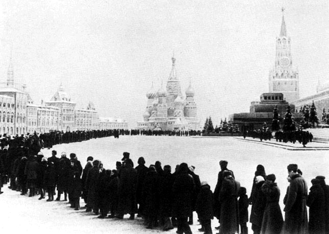

# From Gouda callbacks to Appenzeller CSP

## A quick survey of asynchronous programming models

 

---

# [fit] Grüezi!


^Joel, Pierre, Christoph

---


---

 

---

# Ivan, aka @ikr

* MSc in Mathematics from NSU, Russia
* Living off programming since 2000-03-13
  * C++/Win32/GDI+/MFC/WTL
  * Visual Basic 😱
  * Java Servlets & Swing, C#
  * PHP, *__JavaScript__*


---

# The kind of JavaScript I like

```javascript
var Y = function (f) {
        return function (self) {
            return function (x) {
                return f(self(self))(x);
            };
        }(
            function (self) {
                return function (x) {
                    return f(self(self))(x);
                };
            }
        );
    };
```

---

# The kind of JavaScript I like

```lisp
(define Y 
    (lambda (f)
        ((lambda (x) (x x))
        (lambda (x) (f (lambda (y) ((x x) y)))))))
```

---

# [fit] Why async matters?

---

## Software's eating the world, __and__

## (our) _Free lunch is over_ ―Herb Sutter, 2005

---

# Now, we can only go faster by doing __many things at once__

---

# Threads


---

# Place-oriented programming


 ---

# Shared memory


---

*There are __just a few__ people in the world who can reason effectively about __deadlocks & race conditions__ … They all must be __enslaved__, and made to work on operating systems. And nobody else should go near of this stuff, because it's just __way too complicated.__*

_―Douglas Crockford_


^Photo by Robert Claypool, [CC-licensed](https://creativecommons.org/licenses/by/2.0/), available [here](https://www.flickr.com/photos/35106989@N08/8455616670/)

---

# Alternatives

1. Actors / Message passing
2. Implicit parallelism: DSL-s, logic programming
3. Streams / Reactive programming
4. Event loop

^Speak about declarative

---

# Alternatives

1. Actors / Message passing
2. Implicit parallelism: DSL-s, logic programming
3. Streams / Reactive programming
4. __Event loop__

^Why event loop happened in JS? GUI!

---

# Event loop

```javascript
var event;

while (true) {
    event = System.runtime.nextEvent();
    handle(event);
}
```

---

# Event loop

* Single thread of execution
* No multiprogramming with shared state
* No locking
* No race conditions

---

# Event loop

* Single thread of execution
* No multiprogramming with shared state
* No locking
* No race conditions
* ...And Justice for All 

^Perfect? Almost

---

# The price

1. You must never block

---

# The price

1. You must never block
2. You must never _ever_ block

```javascript
while (true) {
    event = System.runtime.nextEvent();
    handle(event);
}
```

---

# The price

1. You must never block
2. You must never _ever_ block
3. Recovering from an exception is practically impossible (JavaScript-specific)

^ More on that later

---

# The price

1. You must never block
2. You must never _ever_ block
3. Recovering from an exception is practically impossible (JavaScript-specific)
4. __Callbacks__

---

# Why do callbacks even emerge?

---

# Never wait



---

# Never wait

```javascript
var result = doTheWork(a, b);
```

---

# Never wait

```javascript
doTheWork(a, b, function (result) {
    console.log('Got %s', result);
});
```

---

# Example: destination search


---

```javascript
strictMatches(query, function (ids) {
    if (!ids[0]) {
        // Try fuzzy matching
    }

    // In either case, fetch the matched objects' details 
});
```

---

```javascript
strictMatches(query, function (ids) {
    if (!ids[0]) {
        fuzzyMatches(query, function (ids) {
            fetchDetails(ids, function (details) {
                console.dir(details);
            })
        });
    }
    else {
        fetchDetails(ids, function (details) {
            console.dir(details);
        })
    }
});
```

---

```javascript
strictMatches(query, function (ids) {
    if (!ids[0]) {
        fuzzyMatches(query, function (ids) {
            // Now we need details and photos
        });
    }
    else {
        // Same here
    }
});
```

---

```javascript
strictMatches(query, function (ids) {
    if (!ids[0]) {
        fuzzyMatches(query, function (ids) {
            fetchDetails(ids, function (details) {
                fetchPhotos(ids, function (photos) {
                    console.dir(_.merge(details, photos));
                })
            })
        });
    }
    else {
        fetchDetails(ids, function (details) {
            fetchPhotos(ids, function (photos) {
                console.dir(_.merge(details, photos));
            })
        })
    }
});
```

---

# Fetch details and photos in parallel

```javascript
var universalHandler = function () {
        var details, photos;

        return {
            detailsArrived: function (xs) {
                details = xs;
            },

            photosArrived: function (xs) {
                photos = xs;
            }
        };
    };
```

---

# Fetch details and photos in parallel

```javascript
var universalHandler = function (callback) {
        var details,
            photos,

            check = function () {
                if (details && photos) callback(details, photos);
            },

            return {
                detailsArrived: function (xs) { details = xs; },
                photosArrived: function (xs) { photos = xs; }
            };
    };
```

---

# Fetch details and photos in parallel

```javascript
var universalHandler = function (callback) {
        var details,
            photos,

            check = function () {
                if (details && photos) callback(details, photos);
            },

            return {
                detailsArrived: function (xs) { details = xs; check(); },
                photosArrived: function (xs) { photos = xs; check(); }
            };
    };
```

---

# Fetch details and photos in parallel

```javascript
var h = universalHandler(function (details, photos) {
        console.dir(_.merge(details, photos));
    });

fetchDetails(ids, h.detailsArrived);
fetchPhotos(ids, h.photosArrived);
```

---

# [fit] Can things go wrong?

---

```javascript
strictMatches(query, function (ids) {
    if (!ids[0]) {
        fuzzyMatches(query, function (ids) {
            fetchDetails(ids, function (details) {
                fetchPhotos(ids, function (photos) {
                    console.dir(_.merge(details, photos));
                })
            })
        });
    }
    else {
        fetchDetails(ids, function (details) {
            fetchPhotos(ids, function (photos) {
                console.dir(_.merge(details, photos));
            })
        })
    }
});
```

---

# Let's digress a bit

# How do we solve problems
# in software engineering?

---

# Let's digress a bit

# How do we solve problems
# in ~~software~~ engineering?

---

# Abstraction

# &

# Composition

---

# Composable callbacks: control flow libs

```javascript
var callback = function (error, result, ...) {
        if (error) {
            ...
            return;
        }

        ...
    };
```

---

# https://github.com/caolan/async

```javascript
var fetchDetails = function (callback) {
        ...
        callback(null, details);
        ...
    },

    fetchPhotos = function (callback) {
        ...
        callback(null, photos);
        ...
    };
```

---

```javascript
async.parallel([
    fetchDetails,
    fetchPhotos
], function (error, result) {
    if (error) {
        ...
        return;
    }
    
    details = result[0],
    photos = result[1];
    ...
})
```

^That is a _composing_ operator

---

```javascript
async.parallel([
    function (callback) {
        ...
        callback(null, details);
        ...
    },

    function (callback) {
        ...
        callback(null, photos);
        ...
    }
], function (error, result) {
    ...
    details = result[0],
    photos = result[1];
    ...
})
```

---

```javascript
async.waterfall([
    function (callback) {
        // Fetching the strict matches
        ...
        callback(null, ids)
        ...
    },

    function (strictMatchIds, callback) {
        if (strictMatchIds[0]) {
            callback(null, strictMatchIds);
            return;
        }

        // Fetching the fuzzy matches
        ...
        callback(null, ids)
        ...
    }
], function (error, matchedIds) { ... });
```

---

# Function?

```javascript
doComputerStuff(x, y, function (error, result) {
    ...
});
```

---

# Function?

```javascript
doComputerStuff(x, y, function (error, result) {
    ...
});
```

# Emm... Not really

# Functions _return_ things

---

# Promises

# Putting FUN back into function :)

---

# Promises can be returned and passed around

```javascript
var matches = function (query) {
        return strictMatches(query).then(function (strictMatchIds) {
            return (
                strictMatchIds[0] ?
                strictMatchIds :
                fuzzyMatches(query)
            );
        });
    };
```

^No clutter in function signatures

---

# Promises are easy to compose

```javascript
var fetch = function (ids) {
        return Q.all([fetchDetails, fetchPhotos]);
    };
    
matches('bär').then(fetch).spread(function (details, photos) {
    console.dir(_.merge(details, photos));
});
```

^Multiple then-s are possible

---

# Errors bubble up

```javascript
var fetch = function (ids) {
        return Q.all([fetchDetails, fetchPhotos]);
    };
    
matches('bär').then(fetch).spread(function (details, photos) {
    console.dir(_.merge(details, photos));
}).catch(console.error);
```

---

# promises > `async.*`

---

# promises > `async.*`

## Because, _obviously,_ promises are _monadic,_ while `async.*` are just _comonadic_ :)

^Seriously, promises provide a better abstraction than control flow libraries. Approved for ES6.

---

# [fit] But Node.js

---

# But ~~Node.js~~ npm


^Based on a CC-licensed image by EmacsWiki http://www.emacswiki.org/emacs/TabsSpacesBoth

---

# Actually, not that bad

```javascript
var Q = require('q'), request = require('request'),
    
    fetchJeese = function () {
        var deferred = Q.defer();

        request('http://www.swissjeese.com/', function (error, response, body) {
            if (error) {
                deferred.reject(error);
                return;
            }

            deferred.resolve(body);
        });

        return deferred.promise;
    };
```

---

# `Q` even provides

# `nodify` & `denodify` 

# shortcuts

---

# Promises are great.

# Too bad that npm grew so huge without them

---

# Needs improvement

* Can't do too much in an async handler

* Events complect communication & flow of control

^Async nature of the code is too explicit

---

# [fit] Intensify the magic

---

# Tony Hoare


* Author of Quicksort

* Inventor of the NULL reference :)

* Author of “Communicating Sequential Processes” (CSP)

^CC-licensed photo by http://commons.wikimedia.org/wiki/User:Rama from http://en.wikipedia.org/wiki/Tony_Hoare#mediaviewer/File:Sir_Tony_Hoare_IMG_5125.jpg

---

# Implementations based on Hoare's CSP

* Ruby fibers
* C# Async/Await
* Go Goroutines
* Lua  Coroutines
* Clojure core.async

...

and many others

---

# Hoare's CSP

* Processes engage in events: `e → P`

* Recursive notation

```
CH5F = in5f → (
    out2f → out1f → out1f → out1f → CH5F |
    out2f → out2f → out1f → CH5F
)
```

(5 CHF change machine)

---

# Hoare's CSP

* Various process composition operators
  * running in parallel
  * choice
  * interleaving
  * chaining
  * subordination
  ...

---

# Hoare's CSP

```
SMATCH = (
    sm.got.x → SMATCH | sm.none → SMATCH
)

FMATCH = (
    sm.got.x → out.x → FMATCH |
    sm.none → fm.got.y → out.y → FMATCH
)

SMATCH || FMATCH
```

^Dining philosophers example in the book. Rich notation with various composition operators

---

# Hoare's CSP

## Special case of events: channel IO

## Buffers, stacks & queues

## Shared resources access

---

# Big ideas

## Sequential execution

## Channel operations are blocking

## Awaiting execution threads are parked

---

# ES6 has CSP-style coroutines

^Sort of a hack

---

# https://github.com/jmar777/suspend

```javascript
var suspend = require('suspend'), resume = suspend.resume,
    strictMatches = function (query, callback) { ... },
    fuzzyMatches = function (query, callback) { ... };

suspend(function* () {
    var strictMatchIds = yield strictMatches('bär', resume);

    if (strictMatchIds[0]) {
        console.dir(strictMatchIds);
    }
    else {
        console.dir(yield fuzzyMatches('bär', resume));
    }
})();
```

---

# Not a full CSP implementation

* Unbuffered channels only (rendezvous points)
* Multiple readers/writers per channel  are impossible
* No _alt_ support
  * wait for any one (and only one) of a set of channels
  * time-out channels

---

# [fit] Use ClojureScript

---

# [fit] Thank you
