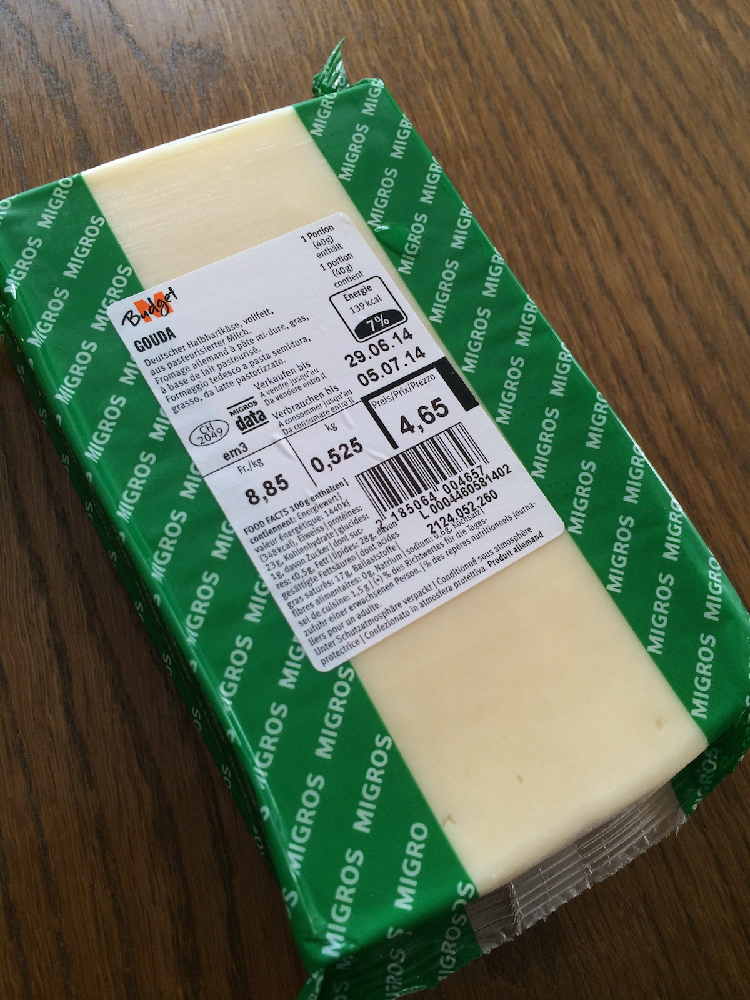
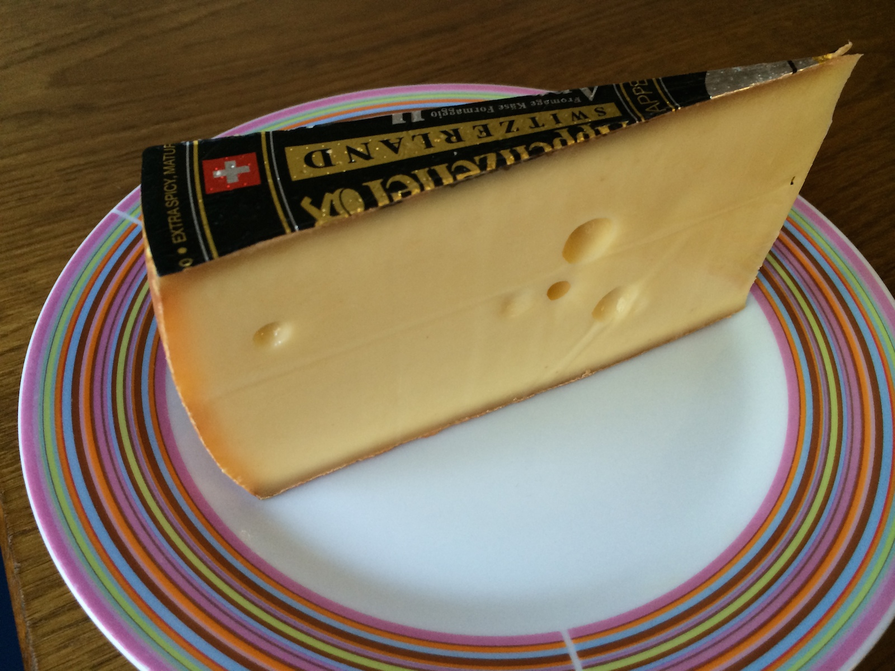

# From Gouda callbacks to Appenzeller CSP

## A quick survey of asynchronous programming models

 

---

# [fit] Grüezi!


---

# [fit] Who?

---

# @ikr

* MSc in Mathematics from NSU, Russia
* Programming for money since 2000-03-13
  * C++/Win32/GDI+/MFC/WTL
  * Visual Basic 😱
  * Java Servlets & Swing, C#
  * PHP, *__JavaScript__*


---

# The kind of JavaScript I like

```javascript
var Y = function (f) {
        return function (self) {
            return function (x) {
                return f(self(self))(x);
            };
        }(
            function (self) {
                return function (x) {
                    return f(self(self))(x);
                };
            }
        );
    };
```

---

# The kind of JavaScript I like

```lisp
(define Y 
    (lambda (f)
        ((lambda (x) (x x))
        (lambda (x) (f (lambda (y) ((x x) y)))))))
```

---

# [fit] Why?

---

## Software's eating the world, __and__

## (our) _Free lunch is over_ ―Herb Sutter, 2005

---

*There are __just a few__ people in the world who can reason effectively about __deadlocks & race conditions__ … They all must be __enslaved__, and made to work on operating systems. And nobody else should go near of this stuff, because it's just __way too complicated.__*

_―Douglas Crockford_


---

### Hello World!

```javascript
var myFunction = function () {
    alert(“Hello World!”)
};
```
